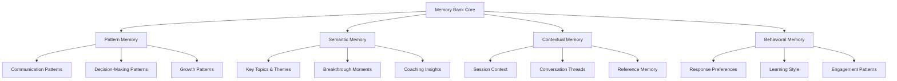
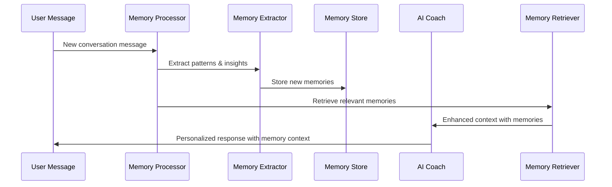
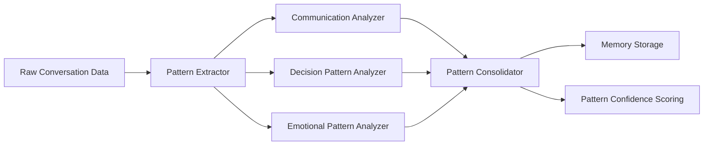
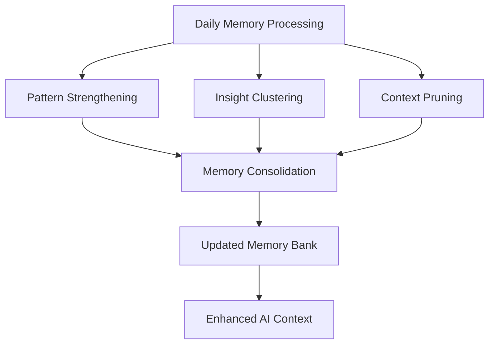

# Memory Bank System - Implementation Plan

## Overview

The Memory Bank system is a comprehensive enhancement to the Agentic Counsel AI coaching platform that provides persistent, intelligent memory across all user interactions. This system will capture long-term patterns, semantic insights, and contextual continuity to create truly personalized coaching experiences.

## System Architecture

### Core Components



### Memory Processing Pipeline



## Implementation Phases

### Phase 1: Foundation (Weeks 1-2)

#### 1.1 Database Schema Design

Create new database tables to support the Memory Bank system:

```sql
-- Core memory bank table
CREATE TABLE user_memory_bank (
  memory_id UUID PRIMARY KEY DEFAULT gen_random_uuid(),
  user_id UUID NOT NULL REFERENCES users(user_id) ON DELETE CASCADE,
  memory_type VARCHAR(50) NOT NULL, -- 'pattern', 'insight', 'context', 'behavioral'
  category VARCHAR(100) NOT NULL,
  content JSONB NOT NULL,
  confidence_score FLOAT DEFAULT 0.7,
  importance_score FLOAT DEFAULT 0.5,
  created_at TIMESTAMP DEFAULT NOW(),
  updated_at TIMESTAMP DEFAULT NOW(),
  last_referenced TIMESTAMP DEFAULT NOW()
);

-- Pattern-specific memory
CREATE TABLE memory_patterns (
  pattern_id UUID PRIMARY KEY DEFAULT gen_random_uuid(),
  user_id UUID NOT NULL REFERENCES users(user_id) ON DELETE CASCADE,
  pattern_type VARCHAR(50) NOT NULL, -- 'communication', 'decision_making', 'stress_response'
  pattern_data JSONB NOT NULL,
  frequency_count INTEGER DEFAULT 1,
  strength_score FLOAT DEFAULT 0.5,
  examples JSONB[], -- Array of conversation examples
  created_at TIMESTAMP DEFAULT NOW(),
  updated_at TIMESTAMP DEFAULT NOW()
);

-- Semantic insights and breakthroughs
CREATE TABLE memory_insights (
  insight_id UUID PRIMARY KEY DEFAULT gen_random_uuid(),
  user_id UUID NOT NULL REFERENCES users(user_id) ON DELETE CASCADE,
  insight_type VARCHAR(50) NOT NULL, -- 'breakthrough', 'realization', 'goal_shift'
  title VARCHAR(255) NOT NULL,
  description TEXT NOT NULL,
  conversation_id UUID REFERENCES coaching_conversations(conversation_id),
  impact_score FLOAT DEFAULT 0.5,
  tags TEXT[],
  created_at TIMESTAMP DEFAULT NOW()
);

-- Contextual memory for conversation continuity
CREATE TABLE memory_context (
  context_id UUID PRIMARY KEY DEFAULT gen_random_uuid(),
  user_id UUID NOT NULL REFERENCES users(user_id) ON DELETE CASCADE,
  context_type VARCHAR(50) NOT NULL, -- 'thread', 'reference', 'follow_up'
  title VARCHAR(255),
  context_data JSONB NOT NULL,
  related_conversations UUID[],
  active BOOLEAN DEFAULT true,
  created_at TIMESTAMP DEFAULT NOW(),
  expires_at TIMESTAMP
);

-- Vector embeddings for semantic search
CREATE TABLE memory_embeddings (
  embedding_id UUID PRIMARY KEY DEFAULT gen_random_uuid(),
  memory_id UUID NOT NULL REFERENCES user_memory_bank(memory_id) ON DELETE CASCADE,
  embedding_vector FLOAT[],
  content_hash VARCHAR(64) NOT NULL,
  created_at TIMESTAMP DEFAULT NOW()
);

-- Create indexes for performance
CREATE INDEX idx_memory_bank_user_id ON user_memory_bank(user_id);
CREATE INDEX idx_memory_bank_type ON user_memory_bank(memory_type);
CREATE INDEX idx_memory_bank_importance ON user_memory_bank(importance_score DESC);
CREATE INDEX idx_memory_patterns_user_id ON memory_patterns(user_id);
CREATE INDEX idx_memory_patterns_type ON memory_patterns(pattern_type);
CREATE INDEX idx_memory_insights_user_id ON memory_insights(user_id);
CREATE INDEX idx_memory_context_user_id ON memory_context(user_id);
CREATE INDEX idx_memory_context_active ON memory_context(user_id, active) WHERE active = true;
```

#### 1.2 Core Memory Service Architecture

```typescript
// apps/api/src/services/memoryBankService.ts

import { DatabaseService } from './database';
import { PersonalityProfile, CoachingContext } from '../types';

export interface MemoryContext {
  relevant_patterns: PatternMemory[];
  key_insights: InsightMemory[];
  contextual_references: ContextMemory[];
  behavioral_preferences: BehavioralMemory[];
  memory_confidence: number;
}

export interface PatternMemory {
  pattern_id: string;
  pattern_type: string;
  pattern_data: any;
  strength_score: number;
  frequency_count: number;
}

export interface InsightMemory {
  insight_id: string;
  insight_type: string;
  title: string;
  description: string;
  impact_score: number;
  tags: string[];
}

export interface ContextMemory {
  context_id: string;
  context_type: string;
  title: string;
  context_data: any;
  related_conversations: string[];
}

export interface BehavioralMemory {
  preference_type: string;
  preference_data: any;
  confidence: number;
}

export class MemoryBankService {
  private databaseService: DatabaseService;

  constructor() {
    this.databaseService = DatabaseService.getInstance();
  }

  // Pattern detection and storage
  async extractAndStorePatterns(userId: string, conversationData: any): Promise<void> {
    // Implementation for pattern extraction
  }

  // Semantic insight extraction
  async extractInsights(userId: string, messageContent: string, context: any): Promise<void> {
    // Implementation for insight extraction
  }

  // Context management
  async updateContextualMemory(userId: string, conversationId: string): Promise<void> {
    // Implementation for context updates
  }

  // Memory retrieval for AI context
  async getRelevantMemories(userId: string, currentContext: string): Promise<MemoryContext> {
    // Implementation for memory retrieval
  }

  // Memory consolidation and cleanup
  async consolidateMemories(userId: string): Promise<void> {
    // Implementation for memory consolidation
  }
}
```

#### 1.3 Database Migration

Create migration file: `apps/api/src/database/migrations/012_create_memory_bank_tables.sql`

### Phase 2: Pattern Recognition (Weeks 3-4)

#### 2.1 Behavioral Pattern Detection



#### 2.2 Pattern Analysis Implementation

```typescript
// apps/api/src/services/patternAnalyzer.ts

export class PatternAnalyzer {
  // Communication pattern analysis
  async analyzeCommunicationPatterns(messages: any[]): Promise<PatternMemory[]> {
    const patterns: PatternMemory[] = [];
    
    // Analyze message length preferences
    const avgLength = messages.reduce((sum, msg) => sum + msg.content.length, 0) / messages.length;
    
    // Analyze question vs statement ratio
    const questionCount = messages.filter(msg => msg.content.includes('?')).length;
    const questionRatio = questionCount / messages.length;
    
    // Analyze emotional language usage
    const emotionalWords = this.detectEmotionalLanguage(messages);
    
    patterns.push({
      pattern_id: '',
      pattern_type: 'communication_style',
      pattern_data: {
        preferred_message_length: avgLength,
        question_ratio: questionRatio,
        emotional_language_usage: emotionalWords
      },
      strength_score: 0.7,
      frequency_count: messages.length
    });
    
    return patterns;
  }

  // Decision-making pattern analysis
  async analyzeDecisionPatterns(messages: any[]): Promise<PatternMemory[]> {
    // Implementation for decision pattern analysis
  }

  // Stress response pattern analysis
  async analyzeStressPatterns(messages: any[]): Promise<PatternMemory[]> {
    // Implementation for stress pattern analysis
  }

  private detectEmotionalLanguage(messages: any[]): number {
    // Implementation for emotional language detection
    return 0.5;
  }
}
```

### Phase 3: Semantic Memory (Weeks 5-6)

#### 3.1 Topic and Theme Tracking

```typescript
// apps/api/src/services/semanticMemoryService.ts

export class SemanticMemoryService {
  // Generate embeddings for semantic search
  async generateEmbeddings(content: string): Promise<number[]> {
    // Integration with embedding service (OpenAI, Cohere, etc.)
    // This would typically call an external API
    return [];
  }

  // Find similar memories using vector search
  async findSimilarMemories(query: string, userId: string): Promise<InsightMemory[]> {
    const queryEmbedding = await this.generateEmbeddings(query);
    
    // Perform vector similarity search
    const similarMemories = await this.vectorSearch(queryEmbedding, userId);
    
    return similarMemories;
  }

  // Cluster related insights
  async clusterRelatedInsights(userId: string): Promise<InsightCluster[]> {
    // Implementation for insight clustering
    return [];
  }

  // Extract key topics from conversation
  async extractTopics(conversationContent: string): Promise<string[]> {
    // Implementation for topic extraction
    return [];
  }

  // Identify breakthrough moments
  async identifyBreakthroughs(messages: any[]): Promise<InsightMemory[]> {
    // Implementation for breakthrough detection
    return [];
  }

  private async vectorSearch(embedding: number[], userId: string): Promise<InsightMemory[]> {
    // Implementation for vector similarity search
    return [];
  }
}

export interface InsightCluster {
  cluster_id: string;
  theme: string;
  insights: InsightMemory[];
  strength: number;
}
```

### Phase 4: Contextual Continuity (Weeks 7-8)

#### 4.1 Conversation Thread Management

```typescript
// apps/api/src/services/contextualMemoryService.ts

export class ContextualMemoryService {
  // Track conversation threads across sessions
  async trackConversationThreads(conversationId: string, userId: string): Promise<void> {
    // Implementation for thread tracking
  }

  // Manage reference memory
  async storeReference(userId: string, referenceType: string, referenceData: any): Promise<void> {
    // Implementation for reference storage
  }

  // Track follow-ups and commitments
  async trackFollowUps(userId: string, commitments: any[]): Promise<void> {
    // Implementation for follow-up tracking
  }

  // Get active contexts for user
  async getActiveContexts(userId: string): Promise<ContextMemory[]> {
    // Implementation for active context retrieval
    return [];
  }

  // Update context based on new conversation
  async updateContextFromConversation(conversationId: string): Promise<void> {
    // Implementation for context updates
  }
}
```

### Phase 5: AI Integration (Weeks 9-10)

#### 5.1 Enhanced Coaching Context

```typescript
// apps/api/src/types/index.ts - Add to existing types

export interface EnhancedCoachingContext extends CoachingContext {
  relevant_patterns: PatternMemory[];
  key_insights: InsightMemory[];
  contextual_references: ContextMemory[];
  behavioral_preferences: BehavioralMemory[];
  memory_confidence: number;
}
```

#### 5.2 Memory-Enhanced AI Service

```typescript
// apps/api/src/services/aiCoachingService.ts - Enhance existing service

export class AICoachingService {
  private memoryBankService: MemoryBankService;

  constructor(config: any) {
    // Existing constructor code
    this.memoryBankService = new MemoryBankService();
  }

  async generateCoachingResponse(context: CoachingContext): Promise<CoachingResponse> {
    try {
      // Get relevant memories
      const memoryContext = await this.memoryBankService.getRelevantMemories(
        context.user_id, 
        context.current_message
      );

      // Create enhanced context
      const enhancedContext: EnhancedCoachingContext = {
        ...context,
        ...memoryContext
      };

      // Build memory-enhanced system prompt
      const systemPrompt = this.buildMemoryEnhancedPrompt(enhancedContext);
      
      // Generate response with memory context
      const response = await this.generateResponseWithMemory(enhancedContext, systemPrompt);

      // Process and store new memories from this interaction
      await this.processNewMemories(enhancedContext, response);

      return response;
    } catch (error) {
      // Fallback to existing logic if memory system fails
      return super.generateCoachingResponse(context);
    }
  }

  private buildMemoryEnhancedPrompt(context: EnhancedCoachingContext): string {
    const basePrompt = this.buildSystemPrompt(context);
    
    const memoryPrompt = `
MEMORY CONTEXT:
${this.formatPatternMemories(context.relevant_patterns)}
${this.formatInsightMemories(context.key_insights)}
${this.formatContextualMemories(context.contextual_references)}
${this.formatBehavioralMemories(context.behavioral_preferences)}

MEMORY INTEGRATION GUIDELINES:
- Reference past conversations naturally when relevant
- Build on previous insights and breakthroughs
- Maintain conversation continuity across sessions
- Adapt communication style based on learned patterns
- Acknowledge growth and changes over time
- Use specific examples from memory when appropriate

Memory Confidence: ${context.memory_confidence}%
`;

    return `${basePrompt}\n\n${memoryPrompt}`;
  }

  private async processNewMemories(context: EnhancedCoachingContext, response: CoachingResponse): Promise<void> {
    // Extract and store new patterns
    await this.memoryBankService.extractAndStorePatterns(context.user_id, {
      message: context.current_message,
      response: response.content,
      context: context
    });

    // Extract and store new insights
    await this.memoryBankService.extractInsights(
      context.user_id,
      context.current_message,
      context
    );

    // Update contextual memory
    await this.memoryBankService.updateContextualMemory(
      context.user_id,
      context.conversation_id
    );
  }

  private formatPatternMemories(patterns: PatternMemory[]): string {
    if (!patterns.length) return '';
    
    return `
BEHAVIORAL PATTERNS:
${patterns.map(p => `- ${p.pattern_type}: ${JSON.stringify(p.pattern_data)} (Strength: ${p.strength_score})`).join('\n')}
`;
  }

  private formatInsightMemories(insights: InsightMemory[]): string {
    if (!insights.length) return '';
    
    return `
KEY INSIGHTS:
${insights.map(i => `- ${i.title}: ${i.description} (Impact: ${i.impact_score})`).join('\n')}
`;
  }

  private formatContextualMemories(contexts: ContextMemory[]): string {
    if (!contexts.length) return '';
    
    return `
CONVERSATION CONTEXT:
${contexts.map(c => `- ${c.title}: ${JSON.stringify(c.context_data)}`).join('\n')}
`;
  }

  private formatBehavioralMemories(behaviors: BehavioralMemory[]): string {
    if (!behaviors.length) return '';
    
    return `
BEHAVIORAL PREFERENCES:
${behaviors.map(b => `- ${b.preference_type}: ${JSON.stringify(b.preference_data)} (Confidence: ${b.confidence})`).join('\n')}
`;
  }
}
```

### Phase 6: Learning and Optimization (Weeks 11-12)

#### 6.1 Memory Consolidation System



#### 6.2 Adaptive Learning Implementation

```typescript
// apps/api/src/services/memoryConsolidationService.ts

export class MemoryConsolidationService {
  // Daily memory processing job
  async processDailyMemories(): Promise<void> {
    const users = await this.getAllActiveUsers();
    
    for (const user of users) {
      await this.consolidateUserMemories(user.user_id);
    }
  }

  // Consolidate memories for a specific user
  async consolidateUserMemories(userId: string): Promise<void> {
    // Strengthen frequently accessed patterns
    await this.strengthenPatterns(userId);
    
    // Cluster related insights
    await this.clusterInsights(userId);
    
    // Prune outdated contexts
    await this.pruneContexts(userId);
    
    // Update importance scores
    await this.updateImportanceScores(userId);
  }

  // Strengthen patterns based on frequency and recency
  private async strengthenPatterns(userId: string): Promise<void> {
    // Implementation for pattern strengthening
  }

  // Cluster related insights for better organization
  private async clusterInsights(userId: string): Promise<void> {
    // Implementation for insight clustering
  }

  // Remove outdated or irrelevant contexts
  private async pruneContexts(userId: string): Promise<void> {
    // Implementation for context pruning
  }

  // Update importance scores based on usage and feedback
  private async updateImportanceScores(userId: string): Promise<void> {
    // Implementation for importance scoring
  }

  private async getAllActiveUsers(): Promise<any[]> {
    // Implementation to get active users
    return [];
  }
}
```

## Integration Points

### 1. Database Service Extension

```typescript
// apps/api/src/services/database.ts - Add memory-related methods

export class DatabaseService {
  // Memory Bank operations
  async storeMemory(userId: string, memoryData: any): Promise<string> {
    // Implementation for storing memories
    return '';
  }

  async getMemoriesByType(userId: string, memoryType: string): Promise<any[]> {
    // Implementation for retrieving memories by type
    return [];
  }

  async updateMemoryImportance(memoryId: string, importance: number): Promise<void> {
    // Implementation for updating memory importance
  }

  async getRecentMemories(userId: string, limit: number): Promise<any[]> {
    // Implementation for getting recent memories
    return [];
  }
}
```

### 2. Coaching Routes Enhancement

```typescript
// apps/api/src/routes/coaching.ts - Add memory processing

// Add memory processing to message handling
router.post('/conversations/:id/messages', async (req: AuthenticatedRequest, res: Response) => {
  // Existing message processing code...
  
  // Process memories after successful AI response
  try {
    const memoryService = new MemoryBankService();
    await memoryService.extractAndStorePatterns(req.user.user_id, {
      conversationId,
      userMessage: content,
      coachResponse: coachingResponse.content
    });
  } catch (memoryError) {
    // Log but don't fail the request
    console.error('Memory processing error:', memoryError);
  }
  
  // Continue with existing response logic...
});
```

### 3. Real-time Memory Updates

```typescript
// apps/api/src/services/socket.ts - Add memory-driven notifications

export class SocketService {
  // Send memory-based insights to user
  async sendMemoryInsight(userId: string, insight: InsightMemory): Promise<void> {
    // Implementation for sending memory insights via socket
  }

  // Notify about pattern recognition
  async notifyPatternRecognition(userId: string, pattern: PatternMemory): Promise<void> {
    // Implementation for pattern notifications
  }
}
```

## Testing Strategy

### Unit Tests
- Memory extraction algorithms
- Pattern recognition accuracy
- Semantic similarity calculations
- Context relevance scoring

### Integration Tests
- End-to-end memory processing pipeline
- AI coaching with memory context
- Database operations and performance
- Real-time memory updates

### Performance Tests
- Memory retrieval speed
- Database query optimization
- Vector search performance
- Memory consolidation efficiency

## Success Metrics

### Technical Metrics
- **Memory Accuracy**: 85%+ accuracy in pattern recognition and insight extraction
- **Context Relevance**: 90%+ of retrieved memories are contextually relevant
- **Response Time**: Memory retrieval adds <200ms to response time
- **Storage Efficiency**: Optimal memory storage with automatic pruning

### User Experience Metrics
- **User Satisfaction**: 20%+ improvement in coaching session satisfaction scores
- **Engagement**: 15%+ increase in session duration and return rates
- **Personalization**: 80%+ of users report feeling "truly understood" by the AI coach
- **Continuity**: 90%+ of users notice improved conversation continuity across sessions

### Business Metrics
- **Retention**: 25%+ improvement in user retention rates
- **Session Quality**: Higher average session ratings
- **User Growth**: Increased word-of-mouth referrals
- **Platform Stickiness**: Longer user lifecycle and engagement

## Deployment Strategy

### Phase 1: Foundation Deployment
1. Deploy database schema changes
2. Deploy core memory services
3. Enable basic memory collection (passive mode)

### Phase 2: Pattern Recognition Deployment
1. Deploy pattern analysis services
2. Enable pattern detection and storage
3. Monitor pattern accuracy and performance

### Phase 3: AI Integration Deployment
1. Deploy enhanced AI coaching service
2. Enable memory-enhanced responses
3. A/B test memory vs non-memory responses

### Phase 4: Full System Deployment
1. Deploy complete memory system
2. Enable all memory features
3. Monitor system performance and user feedback

## Maintenance and Monitoring

### Daily Operations
- Memory consolidation jobs
- Performance monitoring
- Error tracking and resolution
- User feedback analysis

### Weekly Reviews
- Memory accuracy assessment
- Pattern recognition effectiveness
- User satisfaction metrics
- System performance optimization

### Monthly Optimization
- Memory model improvements
- Algorithm refinements
- Database optimization
- Feature enhancements based on usage data

---

## Next Steps

1. **Review and Approval**: Review this implementation plan and provide feedback
2. **Resource Allocation**: Assign development team and timeline
3. **Environment Setup**: Prepare development and testing environments
4. **Phase 1 Implementation**: Begin with database schema and core services
5. **Iterative Development**: Implement each phase with testing and validation
6. **User Testing**: Conduct user testing at each major milestone
7. **Production Deployment**: Deploy to production with monitoring and rollback plans

This Memory Bank system will transform the Agentic Counsel platform into a truly intelligent, personalized coaching experience that learns and grows with each user interaction.