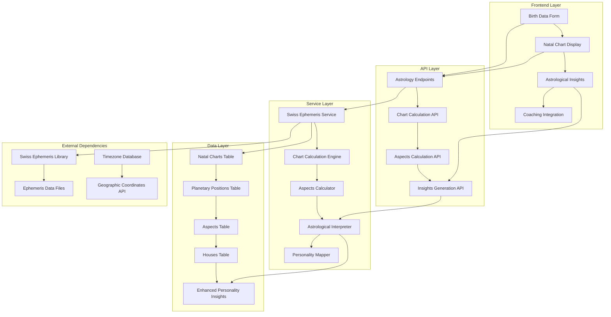
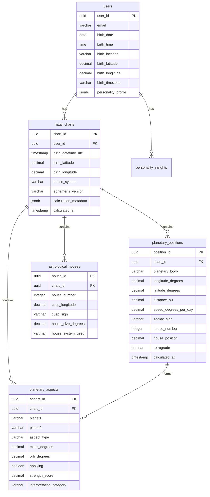
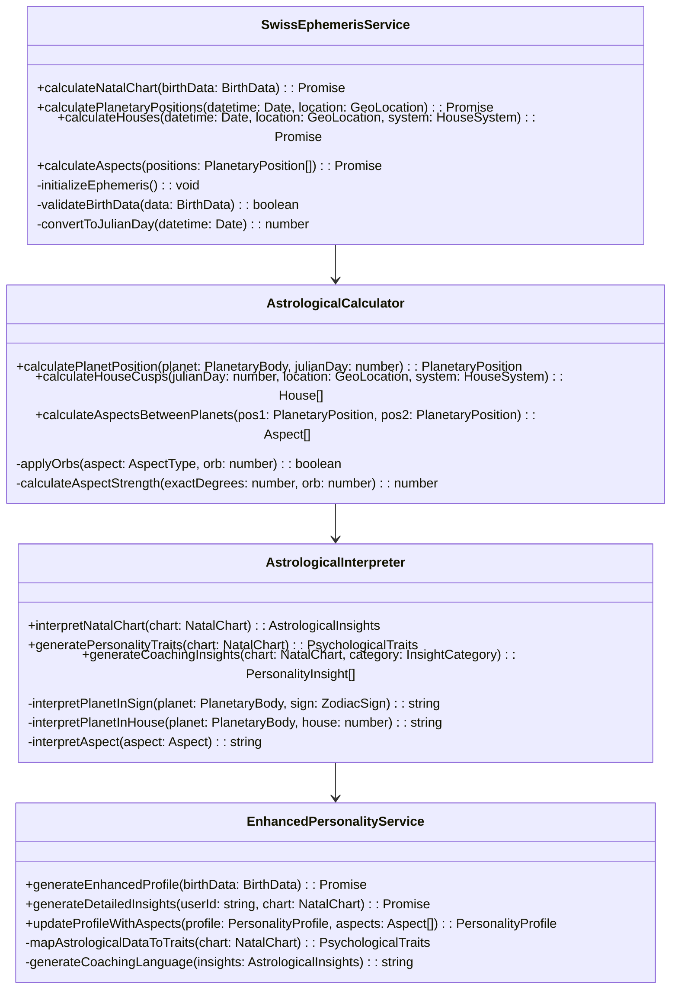
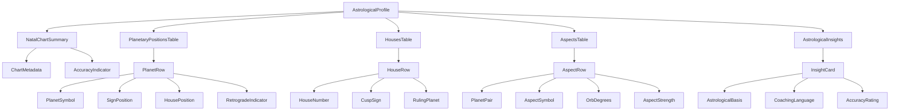

# Swiss Ephemeris Integration Architecture Plan

## Executive Summary

This document outlines the comprehensive architecture for implementing Swiss Ephemeris astrological calculations in the agentic-counsel platform. The integration will replace the current simplified astrological calculations with maximum precision Swiss Ephemeris computations, supporting all major planetary bodies, houses, and aspects.

## Current System Analysis

The agentic-counsel platform currently has:
- **Backend**: Node.js/TypeScript with PostgreSQL database
- **Frontend**: Next.js with TypeScript
- **Basic Astrology**: Simplified calculations in `PersonalityService`
- **Database Schema**: Basic astrological data storage in JSONB format
- **User Flow**: Registration → Birth data collection → Personality profile generation

## Requirements Summary

- **Planetary Bodies**: Sun, Mercury, Venus, Mars, Jupiter, Saturn, Neptune, Uranus, Pluto
- **Key Points**: Rising Sign (Ascendant), Lilith (Black Moon), North Node, South Node
- **House System**: All 12 astrological houses with signs
- **Precision**: Full Swiss Ephemeris library integration with native bindings
- **Aspects**: Major aspects (conjunction, opposition, square, trine, sextile) with 8-10 degree orbs
- **Frontend**: Simple tabular display of astrological data
- **Integration**: Seamless integration with existing personality system

## Technical Architecture Overview



## Database Schema Extensions



### Database Migration Scripts

```sql
-- Migration: Add enhanced birth data fields to users table
ALTER TABLE users 
ADD COLUMN birth_latitude DECIMAL(10, 8),
ADD COLUMN birth_longitude DECIMAL(11, 8),
ADD COLUMN birth_timezone VARCHAR(50);

-- Create natal_charts table
CREATE TABLE natal_charts (
    chart_id UUID PRIMARY KEY DEFAULT gen_random_uuid(),
    user_id UUID NOT NULL REFERENCES users(user_id) ON DELETE CASCADE,
    birth_datetime_utc TIMESTAMP NOT NULL,
    birth_latitude DECIMAL(10, 8) NOT NULL,
    birth_longitude DECIMAL(11, 8) NOT NULL,
    house_system VARCHAR(20) DEFAULT 'Placidus',
    ephemeris_version VARCHAR(20) DEFAULT 'DE431',
    calculation_metadata JSONB,
    calculated_at TIMESTAMP DEFAULT NOW()
);

-- Create planetary_positions table
CREATE TABLE planetary_positions (
    position_id UUID PRIMARY KEY DEFAULT gen_random_uuid(),
    chart_id UUID NOT NULL REFERENCES natal_charts(chart_id) ON DELETE CASCADE,
    planetary_body VARCHAR(20) NOT NULL,
    longitude_degrees DECIMAL(10, 6) NOT NULL,
    latitude_degrees DECIMAL(10, 6) NOT NULL,
    distance_au DECIMAL(12, 8),
    speed_degrees_per_day DECIMAL(10, 6),
    zodiac_sign VARCHAR(15) NOT NULL,
    house_number INTEGER CHECK (house_number >= 1 AND house_number <= 12),
    house_position DECIMAL(5, 2),
    retrograde BOOLEAN DEFAULT FALSE,
    calculated_at TIMESTAMP DEFAULT NOW()
);

-- Create astrological_houses table
CREATE TABLE astrological_houses (
    house_id UUID PRIMARY KEY DEFAULT gen_random_uuid(),
    chart_id UUID NOT NULL REFERENCES natal_charts(chart_id) ON DELETE CASCADE,
    house_number INTEGER NOT NULL CHECK (house_number >= 1 AND house_number <= 12),
    cusp_longitude DECIMAL(10, 6) NOT NULL,
    cusp_sign VARCHAR(15) NOT NULL,
    house_size_degrees DECIMAL(6, 3),
    house_system_used VARCHAR(20) NOT NULL
);

-- Create planetary_aspects table
CREATE TABLE planetary_aspects (
    aspect_id UUID PRIMARY KEY DEFAULT gen_random_uuid(),
    chart_id UUID NOT NULL REFERENCES natal_charts(chart_id) ON DELETE CASCADE,
    planet1 VARCHAR(20) NOT NULL,
    planet2 VARCHAR(20) NOT NULL,
    aspect_type VARCHAR(15) NOT NULL,
    exact_degrees DECIMAL(6, 3) NOT NULL,
    orb_degrees DECIMAL(5, 3) NOT NULL,
    applying BOOLEAN DEFAULT FALSE,
    strength_score DECIMAL(4, 2),
    interpretation_category VARCHAR(50)
);

-- Create indexes for performance
CREATE INDEX idx_natal_charts_user_id ON natal_charts(user_id);
CREATE INDEX idx_planetary_positions_chart_id ON planetary_positions(chart_id);
CREATE INDEX idx_planetary_positions_body ON planetary_positions(planetary_body);
CREATE INDEX idx_astrological_houses_chart_id ON astrological_houses(chart_id);
CREATE INDEX idx_planetary_aspects_chart_id ON planetary_aspects(chart_id);
CREATE INDEX idx_planetary_aspects_planets ON planetary_aspects(planet1, planet2);
```

## Service Layer Architecture



## API Endpoint Specifications

### New Astrology Endpoints

```typescript
// POST /api/astrology/natal-chart
interface CalculateNatalChartRequest {
  birth_date: string;
  birth_time: string;
  birth_location: string;
  birth_latitude: number;
  birth_longitude: number;
  birth_timezone: string;
  house_system?: 'Placidus' | 'Koch' | 'Equal' | 'Whole Sign';
}

interface CalculateNatalChartResponse {
  chart_id: string;
  planetary_positions: PlanetaryPosition[];
  houses: House[];
  aspects: Aspect[];
  calculation_metadata: CalculationMetadata;
}

// GET /api/astrology/chart/:chartId
interface GetNatalChartResponse {
  chart: NatalChart;
  planetary_positions: PlanetaryPosition[];
  houses: House[];
  aspects: Aspect[];
}

// POST /api/astrology/aspects
interface CalculateAspectsRequest {
  chart_id: string;
  aspect_types: AspectType[];
  orb_degrees: number;
}

interface CalculateAspectsResponse {
  aspects: Aspect[];
  aspect_count: number;
  calculation_time_ms: number;
}

// GET /api/user/astrological-profile
interface AstrologicalProfileResponse {
  natal_chart: NatalChart;
  personality_profile: PersonalityProfile;
  astrological_insights: PersonalityInsight[];
  accuracy_confidence: number;
}
```

## Enhanced Type Definitions

```typescript
// Core astrological types
interface NatalChart {
  chart_id: string;
  user_id: string;
  birth_datetime_utc: Date;
  birth_location: GeoLocation;
  planetary_positions: PlanetaryPosition[];
  houses: House[];
  aspects: Aspect[];
  calculation_metadata: CalculationMetadata;
  calculated_at: Date;
}

interface PlanetaryPosition {
  position_id: string;
  planetary_body: PlanetaryBody;
  longitude_degrees: number;
  latitude_degrees: number;
  distance_au: number;
  speed_degrees_per_day: number;
  zodiac_sign: ZodiacSign;
  house_number: number;
  house_position: number;
  retrograde: boolean;
}

interface House {
  house_id: string;
  house_number: number;
  cusp_longitude: number;
  cusp_sign: ZodiacSign;
  house_size_degrees: number;
  ruling_planet: PlanetaryBody;
  house_system_used: HouseSystem;
}

interface Aspect {
  aspect_id: string;
  planet1: PlanetaryBody;
  planet2: PlanetaryBody;
  aspect_type: AspectType;
  exact_degrees: number;
  orb_degrees: number;
  applying: boolean;
  strength_score: number;
  interpretation: string;
}

interface GeoLocation {
  latitude: number;
  longitude: number;
  timezone: string;
  location_name: string;
}

interface CalculationMetadata {
  ephemeris_version: string;
  house_system: HouseSystem;
  calculation_time_ms: number;
  swiss_ephemeris_version: string;
  coordinate_system: string;
}

// Enums and types
type PlanetaryBody = 
  | 'Sun' | 'Moon' | 'Mercury' | 'Venus' | 'Mars' 
  | 'Jupiter' | 'Saturn' | 'Uranus' | 'Neptune' | 'Pluto'
  | 'North Node' | 'South Node' | 'Lilith' | 'Ascendant' | 'Midheaven';

type ZodiacSign = 
  | 'Aries' | 'Taurus' | 'Gemini' | 'Cancer' | 'Leo' | 'Virgo'
  | 'Libra' | 'Scorpio' | 'Sagittarius' | 'Capricorn' | 'Aquarius' | 'Pisces';

type AspectType = 'conjunction' | 'opposition' | 'square' | 'trine' | 'sextile';

type HouseSystem = 'Placidus' | 'Koch' | 'Equal' | 'Whole Sign';

// Enhanced personality types
interface EnhancedPersonalityProfile extends PersonalityProfile {
  natal_chart_id: string;
  planetary_emphasis: PlanetaryEmphasis;
  elemental_balance: ElementalBalance;
  modal_balance: ModalBalance;
  aspect_patterns: AspectPattern[];
  dominant_themes: string[];
}

interface PlanetaryEmphasis {
  strongest_planet: PlanetaryBody;
  weakest_planet: PlanetaryBody;
  angular_planets: PlanetaryBody[];
  retrograde_planets: PlanetaryBody[];
}

interface ElementalBalance {
  fire: number;
  earth: number;
  air: number;
  water: number;
  dominant_element: 'fire' | 'earth' | 'air' | 'water';
}

interface ModalBalance {
  cardinal: number;
  fixed: number;
  mutable: number;
  dominant_mode: 'cardinal' | 'fixed' | 'mutable';
}

interface AspectPattern {
  pattern_type: 'Grand Trine' | 'T-Square' | 'Grand Cross' | 'Yod' | 'Stellium';
  involved_planets: PlanetaryBody[];
  pattern_strength: number;
  interpretation: string;
}
```

## Frontend Component Architecture



### Component Specifications

```typescript
// Main astrological profile component
interface AstrologicalProfileProps {
  userId: string;
  showDetailedView?: boolean;
}

// Planetary positions table
interface PlanetaryPositionsTableProps {
  positions: PlanetaryPosition[];
  sortBy?: 'planet' | 'sign' | 'house';
  showRetrograde?: boolean;
}

// Houses table
interface HousesTableProps {
  houses: House[];
  showRulingPlanets?: boolean;
  houseSystem: HouseSystem;
}

// Aspects table
interface AspectsTableProps {
  aspects: Aspect[];
  filterByStrength?: number;
  groupByType?: boolean;
}

// Astrological insights
interface AstrologicalInsightsProps {
  insights: PersonalityInsight[];
  category?: InsightCategory;
  showAstrologicalBasis?: boolean;
}
```

## Implementation Roadmap

### Phase 1: Foundation (Weeks 1-2)
**Objective**: Set up Swiss Ephemeris infrastructure

**Tasks**:
- Install Swiss Ephemeris library with Node.js bindings (`swisseph` package)
- Download and configure DE431 ephemeris data files
- Set up timezone database integration
- Create basic Swiss Ephemeris service wrapper
- Implement error handling for native library calls

**Deliverables**:
- Working Swiss Ephemeris service
- Basic planetary position calculations
- Unit tests for core calculations

### Phase 2: Core Calculations (Weeks 3-4)
**Objective**: Implement comprehensive astrological calculations

**Tasks**:
- Implement planetary position calculations for all required bodies
- Add house system calculations (Placidus as primary)
- Create aspects calculation engine with configurable orbs
- Build coordinate system conversions
- Add validation for birth data and edge cases

**Deliverables**:
- Complete calculation engine
- Aspects calculator with major aspects
- Comprehensive test suite

### Phase 3: Data Integration (Weeks 5-6)
**Objective**: Integrate with existing database and services

**Tasks**:
- Create database migrations for new astrological tables
- Implement database services for storing natal chart data
- Extend existing PersonalityService with Swiss Ephemeris
- Add caching strategy for calculated charts
- Create data migration scripts for existing users

**Deliverables**:
- Enhanced database schema
- Updated PersonalityService
- Data migration tools

### Phase 4: API Development (Weeks 7-8)
**Objective**: Build comprehensive astrology API

**Tasks**:
- Create new astrology API endpoints
- Integrate with existing authentication middleware
- Add comprehensive error handling and validation
- Implement rate limiting for calculation-heavy endpoints
- Create API documentation

**Deliverables**:
- Complete astrology API
- API documentation
- Rate limiting and security measures

### Phase 5: Frontend Integration (Weeks 9-10)
**Objective**: Create user-facing astrological components

**Tasks**:
- Create tabular display components for natal chart data
- Enhance existing PersonalityDisplay component
- Add astrological insights to dashboard
- Implement responsive design for mobile devices
- Create loading states and error handling

**Deliverables**:
- Complete frontend components
- Enhanced dashboard with astrological data
- Mobile-responsive design

### Phase 6: Enhanced Insights (Weeks 11-12)
**Objective**: Develop sophisticated astrological interpretation

**Tasks**:
- Develop astrological interpretation engine
- Integrate aspects into personality trait generation
- Enhance coaching language with astrological context
- Add accuracy confidence scoring
- Create aspect pattern recognition

**Deliverables**:
- Advanced interpretation engine
- Enhanced personality insights
- Aspect pattern analysis

### Phase 7: Testing & Optimization (Weeks 13-14)
**Objective**: Ensure production readiness

**Tasks**:
- Comprehensive testing of all astrological calculations
- Performance optimization for large-scale calculations
- User acceptance testing with real birth data
- Security audit and penetration testing
- Documentation and deployment preparation

**Deliverables**:
- Production-ready system
- Complete documentation
- Performance benchmarks
- Security clearance

## Technical Considerations

### Swiss Ephemeris Integration
- **Library**: Use `swisseph` Node.js bindings for native performance
- **Data Files**: Include DE431 ephemeris files for maximum accuracy (2000-2100 CE)
- **Memory Management**: Implement proper cleanup for native library resources
- **Error Handling**: Robust validation for edge cases and invalid dates
- **Thread Safety**: Ensure thread-safe operations for concurrent calculations

### Performance Optimization
- **Caching Strategy**: 
  - Redis cache for calculated natal charts (charts rarely change)
  - In-memory cache for frequently accessed ephemeris data
  - Database query optimization with proper indexing
- **Lazy Loading**: Calculate aspects and detailed interpretations on-demand
- **Background Processing**: Queue system for intensive calculations
- **Connection Pooling**: Optimize database connections for high load

### Security & Privacy
- **Birth Data Encryption**: Encrypt sensitive birth time/location data at rest
- **Access Controls**: Ensure users can only access their own astrological data
- **Data Retention**: Implement GDPR-compliant data handling and deletion
- **Audit Logging**: Track all astrological calculations for debugging and compliance
- **Input Validation**: Comprehensive validation of all birth data inputs

### Scalability Considerations
- **Horizontal Scaling**: Design services to be stateless for easy scaling
- **Database Sharding**: Plan for user data sharding if needed
- **CDN Integration**: Serve static ephemeris data from CDN
- **Monitoring**: Comprehensive monitoring of calculation performance and accuracy

## Dependencies and Requirements

### Backend Dependencies
```json
{
  "swisseph": "^2.10.3",
  "moment-timezone": "^0.5.43",
  "geotz": "^7.0.7",
  "node-geocoder": "^4.2.0"
}
```

### System Requirements
- **Disk Space**: 500MB for ephemeris data files
