# Agentic Counsel - System Architecture Diagram

This document contains the complete system architecture diagram for the Agentic Counsel AI-powered legal assistance platform.

## System Overview

Agentic Counsel is a progressive onboarding AI coaching platform that provides personalized astrological insights through a three-tier birth data system. The architecture supports real-time coaching sessions, personality profiling, and progress tracking.

## Architecture Diagram

```mermaid
graph TB
    subgraph "Frontend - Next.js Web Application"
        subgraph "Pages (App Router)"
            HomePage["/page.tsx<br/>Landing Page"]
            Login["/login/page.tsx<br/>Authentication"]
            Register["/register/page.tsx<br/>User Registration"]
            Onboarding["/onboarding/page.tsx<br/>3-Step Onboarding"]
            Dashboard["/dashboard/page.tsx<br/>User Dashboard"]
            Coaching["/coaching/[id]/page.tsx<br/>Real-time Coaching"]
            Astrology["/astrology/page.tsx<br/>Birth Chart"]
            Progress["/progress/page.tsx<br/>Progress Tracking"]
        end

        subgraph "Components"
            TieredNatal["TieredNatalChart<br/>Progressive Birth Data<br/>(3 Tiers)"]
            PersonalityDisplay["PersonalityDisplay<br/>Personality Insights"]
            CoachingCard["CoachingCard<br/>Session Card"]
            ProgressCharts["ProgressCharts<br/>Goal Progress"]
            ProfileCompletion["ProfileCompletionWidget<br/>Profile Status"]
            NatalForm["NatalChartForm<br/>Birth Data Input"]
        end

        subgraph "Context & State"
            AuthContext["AuthContext<br/>User Authentication"]
        end

        subgraph "API Client Libraries"
            APIClient["api.ts<br/>HTTP Client"]
            SocketClient["socket.ts<br/>WebSocket Client"]
            GeocodingLib["geocoding.ts<br/>Location Services"]
        end
    end

    subgraph "Backend - Express.js API Server"
        subgraph "HTTP Routes"
            AuthRoutes["/api/auth<br/>Login/Register"]
            UserRoutes["/api/user<br/>Profile Management"]
            CoachingRoutes["/api/coaching<br/>AI Coaching Sessions"]
            ProgressRoutes["/api/progress<br/>Goal Tracking"]
            AstrologyRoutes["/api/astrology<br/>Natal Charts"]
            EnhancementRoutes["/api/user-enhancement<br/>Profile Enhancement"]
        end

        subgraph "Middleware"
            AuthMiddleware["Auth Middleware<br/>JWT Validation"]
            ErrorHandler["Error Handler<br/>Global Error Management"]
            RateLimiter["Rate Limiter<br/>API Protection"]
        end

        subgraph "Core Services"
            DatabaseService["DatabaseService<br/>PostgreSQL Connection"]
            RedisService["RedisService<br/>Caching & Sessions"]
            SocketService["SocketService<br/>Real-time Communication"]
            PersonalityService["PersonalityService<br/>Profile Generation"]
            SwissEphemeris["SwissEphemerisService<br/>Astronomical Calculations"]
            AICoaching["AICoachingService<br/>Anthropic Claude API"]
        end
    end

    subgraph "Database - PostgreSQL"
        Users["users<br/>- user_id<br/>- email<br/>- birth_data<br/>- personality_profile<br/>- coaching_goals"]
        CoachingConversations["coaching_conversations<br/>- conversation_id<br/>- user_id<br/>- session_type<br/>- status"]
        CoachingMessages["coaching_messages<br/>- message_id<br/>- conversation_id<br/>- sender_type<br/>- content"]
        ProgressTracking["progress_tracking<br/>- tracking_id<br/>- user_id<br/>- goal_category<br/>- milestones"]
        PersonalityInsights["personality_insights<br/>- insight_id<br/>- user_id<br/>- category<br/>- coaching_language"]
        NatalCharts["natal_charts<br/>- chart_id<br/>- user_id<br/>- birth_data"]
        PlanetaryPositions["planetary_positions<br/>- celestial_body<br/>- longitude<br/>- zodiac_sign"]
        HouseCusps["house_cusps<br/>- house_number<br/>- cusp_longitude"]
        Aspects["aspects<br/>- body1/body2<br/>- aspect_type<br/>- orb"]
    end

    subgraph "External Services"
        Anthropic["Anthropic Claude API<br/>AI Coaching Responses"]
        SwissEph["Swiss Ephemeris<br/>Astronomical Data"]
    end

    subgraph "Shared Package"
        SharedTypes["@/types<br/>TypeScript Interfaces<br/>- User, PersonalityProfile<br/>- CoachingSession, Message<br/>- NatalChart, BirthData<br/>- ProgressTracking<br/>- API Response Types"]
    end

    subgraph "Progressive Onboarding Flow"
        Tier1["Tier 1: No Birth Data<br/>Basic Profile"]
        Tier2["Tier 2: Birth Date Only<br/>Sun & Moon Signs<br/>60% Accuracy"]
        Tier3["Tier 3: Complete Data<br/>Full Chart & Houses<br/>85% Accuracy"]
    end

    %% Frontend to Backend connections
    HomePage --> Login
    HomePage --> Register
    Register --> Onboarding
    Login --> Dashboard
    Onboarding --> Dashboard
    Dashboard --> Coaching
    Dashboard --> Progress
    Dashboard --> Astrology

    %% API connections
    APIClient --> AuthRoutes
    APIClient --> UserRoutes
    APIClient --> CoachingRoutes
    APIClient --> ProgressRoutes
    APIClient --> AstrologyRoutes
    APIClient --> EnhancementRoutes

    %% Socket connections
    SocketClient -.->|WebSocket| SocketService
    Coaching -.->|Real-time| SocketService

    %% Service connections
    AuthRoutes --> DatabaseService
    UserRoutes --> DatabaseService
    UserRoutes --> PersonalityService
    CoachingRoutes --> AICoaching
    CoachingRoutes --> DatabaseService
    CoachingRoutes --> SocketService
    ProgressRoutes --> DatabaseService
    AstrologyRoutes --> SwissEphemeris
    AstrologyRoutes --> DatabaseService

    %% External API connections
    AICoaching --> Anthropic
    SwissEphemeris --> SwissEph
    PersonalityService --> SwissEphemeris

    %% Database relationships
    DatabaseService --> Users
    DatabaseService --> CoachingConversations
    DatabaseService --> CoachingMessages
    DatabaseService --> ProgressTracking
    DatabaseService --> PersonalityInsights
    DatabaseService --> NatalCharts
    DatabaseService --> PlanetaryPositions
    DatabaseService --> HouseCusps
    DatabaseService --> Aspects

    %% Progressive enhancement flow
    Tier1 --> Tier2
    Tier2 --> Tier3
    TieredNatal --> Tier1
    TieredNatal --> Tier2
    TieredNatal --> Tier3

    %% Shared types usage
    Frontend -.->|imports| SharedTypes
    Backend -.->|imports| SharedTypes

    %% Redis connections
    RedisService --> AuthMiddleware
    RedisService --> SocketService

    %% Key features highlighted
    style Anthropic fill:#f9f,stroke:#333,stroke-width:4px
    style SocketService fill:#bbf,stroke:#333,stroke-width:2px
    style TieredNatal fill:#bfb,stroke:#333,stroke-width:2px
    style PersonalityService fill:#fbf,stroke:#333,stroke-width:2px
```

## Key Architectural Components

### 1. Frontend (Next.js App Router)
- **Pages**: Landing, authentication, onboarding, dashboard, coaching, astrology, progress
- **Components**: TieredNatalChart, PersonalityDisplay, ProfileCompletionWidget
- **State Management**: AuthContext for user authentication
- **API Integration**: HTTP client and WebSocket client for backend communication

### 2. Backend (Express.js API)
- **Routes**: Authentication, user management, coaching, progress, astrology, enhancement
- **Middleware**: JWT authentication, error handling, rate limiting
- **Services**: Database, Redis, Socket.IO, Personality, Swiss Ephemeris, AI Coaching

### 3. Database Schema (PostgreSQL)
- **Core Tables**: users, coaching_conversations, coaching_messages, progress_tracking
- **Astrology Tables**: natal_charts, planetary_positions, house_cusps, aspects
- **Insights**: personality_insights for coaching language

### 4. Progressive Onboarding System
- **Tier 1**: Basic behavioral profile (30% accuracy)
- **Tier 2**: Birth date only - Sun/Moon signs (60% accuracy)
- **Tier 3**: Complete birth data - Full chart (85% accuracy)

### 5. External Integrations
- **Anthropic Claude API**: AI-powered coaching responses
- **Swiss Ephemeris**: Astronomical calculations for natal charts

### 6. Shared Types Package
- Centralized TypeScript interfaces for type safety across the monorepo
- Includes User, PersonalityProfile, CoachingSession, NatalChart, and API response types

## Data Flow

1. **User Registration**: Simplified registration → Optional birth data → Personality profile generation
2. **Progressive Enhancement**: Users can upgrade their profile tier to unlock deeper insights
3. **Real-time Coaching**: WebSocket connections enable live coaching sessions with AI
4. **Progress Tracking**: Milestone-based goal tracking with personality-aligned metrics
5. **Astrological Insights**: Swiss Ephemeris calculations with graceful degradation for missing data

## Key Features

- **Trust-First Onboarding**: Users can start without birth data and progressively add information
- **Real-time Communication**: WebSocket-based coaching sessions
- **Graceful Degradation**: System works with partial or missing birth data
- **AI-Powered Coaching**: Anthropic Claude integration for personalized coaching
- **Comprehensive Tracking**: Progress monitoring with personality-aligned metrics
- **Type Safety**: Shared TypeScript interfaces across the entire system

## Technology Stack

- **Frontend**: Next.js 14 (App Router), React, TypeScript, Tailwind CSS
- **Backend**: Node.js, Express.js, Socket.IO, TypeScript
- **Database**: PostgreSQL with structured schema
- **Caching**: Redis for sessions and real-time data
- **AI Integration**: Anthropic Claude API
- **Monorepo**: Shared packages for type definitions and utilities
- **Astronomical Calculations**: Swiss Ephemeris integration

---

*This diagram represents the current state of the system as of the optional birth data implementation (feature/optional-birth-data branch).*